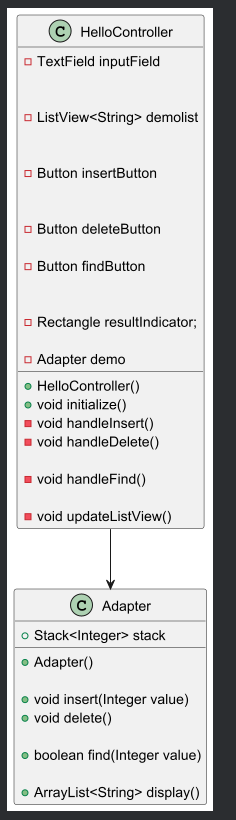
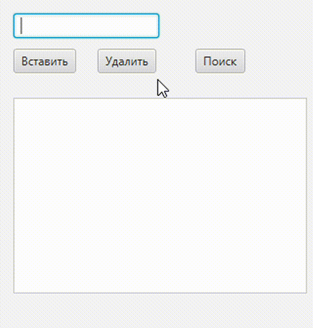

## Task10 | Адаптер
Проблема. Имеется готовый пакет с  реализацией "особой" структуры данных с набором собственных методов и  приватных полей. необходимо на его основе создать программу демонстрирующую работу с такой структурой данных.
Вариант STACK
### Теоретическая справка
## Стек 
Стек — это структура данных, в которой элементы добавляются и удаляются в порядке «последним пришел, первым ушел». Из-за такого поведения их иногда называют списками LIFO, или просто LIFO (от англ. last in first out)
Класс стека предусматривает специальные методы:
Push (вталкивание в стек) - для добавления элемента в вершину;
Pop (выталкивание) - для удаления из вершины.
Чтобы получить элемент из вершины стека без его удаления из структуры данных используется метод peek()   
Также для стека предусмотрены два служебных метода:
isEmpty() - возвращает true, если стек не содержит ни одного элемента;
isFull() - возвращает true, если стек полон и добавление новых элементов невозможно, (весь массив, выделенный под хранение стека заполнен данными). 
## Адаптер
Паттерн Адаптер (Adapter) предназначен для преобразования интерфейса одного класса в интерфейс другого.Реализации данного паттерна позволяет использовать вместе классы с несовместимыми интерфейсами. 

Клиент (Client) — это класс, который содержит логику программы.

Сервис (Adaptee) – сторонний интерфейс/класс, к-й Клиент не может использовать напрямую.

Адаптер (Adaptor) — это класс, который может одновременно работать и с клиентом, и с сервисом. Он реализует клиентский интерфейс  и содержит ссылку на объект сервиса. Адаптер получает вызовы от клиента через методы клиентского интерфейса, а затем переводит их в вызовы методов обёрнутого объекта в правильном формате.

### Результат

