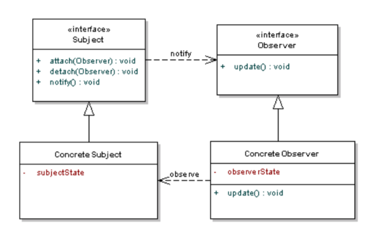
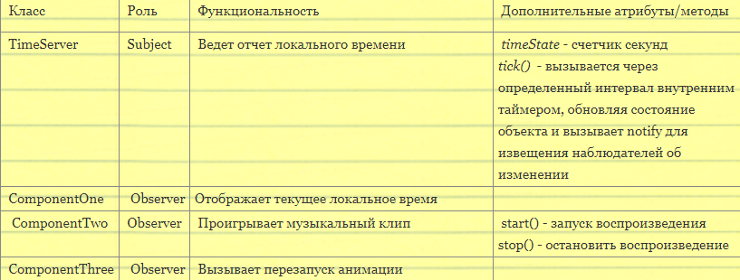
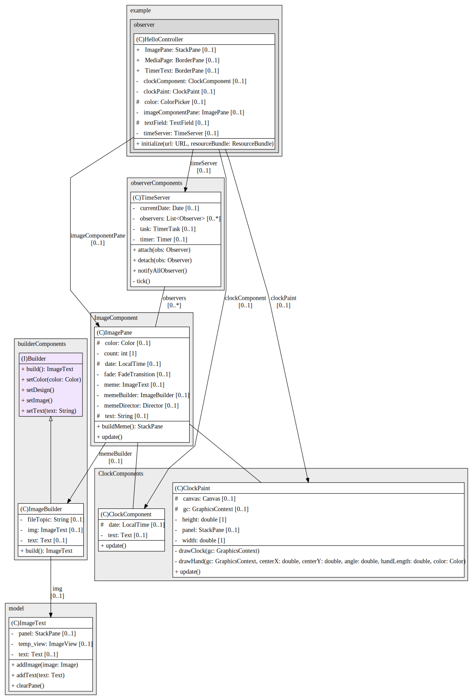
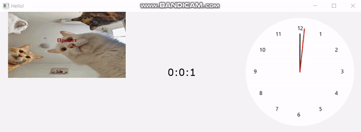

## Task7 | Наблюдатель
### Условия задачи
Требуется реализовать программу в которой одни объект - выполняет некоторую задачу, а три другие отслеживают его состояния для реализации собственной функциональности в соответствии с ролями:
### Теоретическая справка
Паттерн Наблюдатель (Observer) определяет зависимость "один-ко-многим" между объектами так, что при изменении состояния одного объекта все зависящие от него объекты уведомляются и обновляются автоматически.

Паттерн Observer определяет объект Subject, хранящий данные (модель), а всю функциональность "представлений" делегирует слабосвязанным отдельным объектам Observer. 

При создании наблюдатели Observer регистрируются у объекта Subject. 

Когда объект Subject изменяется, он извещает об этом всех зарегистрированных наблюдателей. После этого каждый обозреватель запрашивает у объекта Subject ту часть состояния, которая необходима для отображения данных.

  <  
    
  <
    
    
  <  

    
### Диаграмма классов

### Результат

